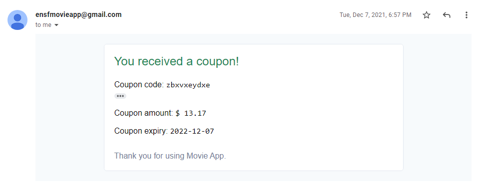

# Movie Theater Ticket Reservation App

Term project for ENSF 614 - Fall 2021


## Objectives
The goal of this project is to create a movie ticket registration system, where users can both buy and cancel tickets.
Please refer to the [project description document](docs/Project_Description.pdf) for further details.

## Project Demonstration
First, we see the main screen where users select a movie. They also have the option to log in if they are 
a registered user with an account<br>
<br>

Here is the signup form, where a user can sign up if they wish to be a registered user (Registered users
pay a $15 annual fee, and don't pay cancellation fees, plus have access to movies not yet
released publicly).<br>
<br>

Here is the ticket purchasing form, along with the email you receive after a successful purchase<br>

<br>

Here is the ticket cancellation form, along with the coupon you receive after a successful cancellation. 
It should be noted that tickets cannot be cancelled within 72 hours of the show starting.<br>

<br>

## Project Design
Diagrams for the design phase of the project can be found in our [Design Phase Document](docs/Design_Phase.pdf),
which contains: Use case scenarios, use case diagram, systems activity diagram, state transition diagram, system
interation diagram, UML diagram, package diagram, deployment diagram, wireframes, and a database model. 


## Project Structure


+ [`config`](config) - contains the config files containing important settings for the project to work

+ [`docs`](docs) - various documents, including system diagrams, of the project

   + [`docs/javadoc.zip`](docs/javadoc.zip) - javadoc as zip archive

+ [`lib`](lib) - contains the JARs used by the project

+ [`src`](src) - contains all the source code as `.java` files


## How to run

1. Clone the repository to your local machine.

2. Start the MySQL server on your local machine. 

3. Open the file [config/db_details.properties](config/db_details.properties) and enter your Db server details. For `db.user` and `db.password`, enter your DB user login details. Please use a user that has all the CRUD access, like `root`.

3. Connect to your MySQL server using an user used in step 3.

4. Run [this](ENSF614_Project_Database.sql) script on the MySQL server. This script will create a schema **ENSF614PROJECT**, create all necessary tables, and load them with some dummy data.

5. To compile the source code, run the below command
   ```bash
   $ javac -cp ".;lib/*" -sourcepath "src" -d "bin" src/movieTicketSystem/*java src/movieTicketSystem/controller/*java src/movieTicketSystem/model/*java src/movieTicketSystem/view/*java
   ```

6. To run the source code, run the below command
   ```bash
   $ java -cp ".;lib/*;bin" movieTicketSystem.movieApp
   ```


## Contributors

+ [Giese, Calvin](https://github.com/calvingiese)
+ [Guo, Yuhua](https://github.com/davedaveisguo)
+ [Gupta, Bhavyai](https://github.com/zbhavyai)
+ [Hall, Graydon ](https://github.com/GraydonHall42)
